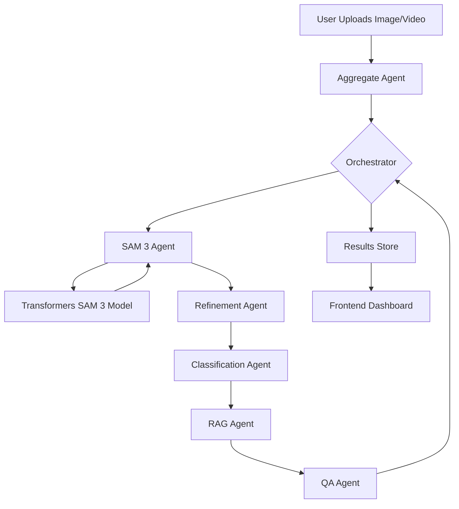

# Product-Grade Autonomous Annotation System Specification

## 1. Overview / Goals

- **Goal**: Build a web app that turns raw images/video into production-ready COCO datasets with minimal human effort.
- **Key Features**: Visualization, Manual Editing, QA Workflows, Analytics, Export.
- **Evaluation**: IoU, mIoU, Boundary F1, Confidence Fusion.
- **Workflow**: Human-in-the-loop correction & Active Learning.

## 2. UI Wireframes & Pages

### 2.1 Dashboard

- **Top**: Project selector, Quick stats (Throughput, Est. Completion).
- **Main**: Activity Feed, Quick Actions (Upload, Batch Annotate).

### 2.2 Project / Dataset Page

- **Filters**: Label, Confidence, IoU, Date.
- **Grid**: Thumbnails with quality overlays (Green/Amber/Red).
- **Actions**: Bulk export, Re-cluster.

### 2.3 Image Annotation Viewer (Core Editor)

- **Canvas**: Layered masks, Alpha matte toggle.
- **Tools**: Brush, Polygon, BBox, Magic Wand, Eraser.
- **Inspector**: Mask properties (Area, Confidence), Label Suggestions (RAG).
- **Bottom**: Save, Reject, Flag, Propagate (Video).

### 2.4 QA / Review Queue

- **Queue**: Sorted by lowest confidence/disagreement.
- **Widget**: Pass/Fail toggles, Reason suggestions.

### 2.5 Analytics

- **Charts**: mIoU over time, Label Drift, Cost Savings.
- **Heatmaps**: Dataset coverage.

## 3. Evaluation Metrics

- **IoU**: Intersection over Union per mask.
- **Confidence Fusion**: Weighted score (SAM3 + Classifier + QA + RAG).
- **Boundary F1**: Edge accuracy.

## 4. Backend Architecture

### 4.1 Services

- **Auth**: JWT based.
- **Storage**: S3/MinIO (Images), Postgres (Metadata), Vector DB (RAG).
- **Core Agents**: Segmentation (SAM3), Classification (CLIP), QA, Aggregator.
- **Orchestrator**: Job Queue (Celery/Ray).

### 4.2 Data Model

- **Project**: `{ id, name, owner, labels[], created_at }`
- **Image**: `{ id, project_id, path, width, height, status }`
- **Annotation**: `{ id, image_id, segmentation, bbox, label, confidence, iou, created_by_agent }`

## 5. SAM 3 Integration Strategy

### 5.1 Architecture Flow (SAM 3 Extended)

### 5.2 Technical Stack Update

- **Library**: `transformers` (Hugging Face)
- **Model**: `facebook/sam3` (gated)
- **Processor**: `Sam3Processor` for text/visual prompts.
- **Hardware**: CUDA GPU required for efficient inference.

### 5.3 Automated Segmentation Pipeline

1.  **Auto-Segment**: If no prompt is provided, use grid point generation strategies via `Sam3Processor`.
2.  **Text Prompting**: Use `processor(images=image, text="<prompt>")` for Zero-Shot segmentation.
3.  **RAG Fusion**: Use embeddings from SAM 3 encoder to retrieve similar labeled objects from vector DB (RAG) to ensure label consistency across frames/images.

## 6. MVP Deliverables (Updated)

1.  **Web UI**: Modern Bento Grid + Dark Mode.
2.  **Backend**: SAM 3 (Transformers) + RAG + CLIP.
3.  **Pipeline**: Automomous segmentation with text prompt support.
4.  **Storage**: Local FS + SQLite.
