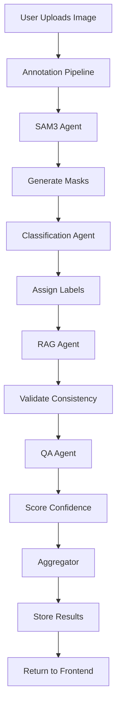

# ANNOTIX: Architecture Specification

## 1. Overview / Goals

- **Goal**: Build a web application that turns raw images/videos into production-ready COCO datasets with minimal human effort.
- **Key Features**: Autonomous annotation, visualization, QA workflows, analytics, export.
- **Evaluation**: IoU, mIoU, Boundary F1, Confidence Fusion.
- **Workflow**: Automated annotation with optional human-in-the-loop correction.

## 2. UI Pages & Components

### 2.1 Home Page

- **Hero Section**: Welcome message with quick upload zone
- **Quick Actions**: Create project, import dataset, view recent
- **Stats Overview**: Total projects, images, annotations

### 2.2 Dashboard

- **Bento Grid Layout**: Asymmetric cards for visual hierarchy
- **Stats Cards**: Project counts, annotation progress
- **Recent Activity**: Live feed of recent actions
- **System Status**: Backend health monitoring

### 2.3 Project Gallery

- **Image Grid**: Thumbnails with annotation status
- **Filters**: By status, label, confidence
- **Actions**: Annotate, export, delete

### 2.4 Annotation Editor

- **Canvas**: Interactive image viewer with mask overlay
- **Prompt Input**: Text-based annotation with SAM3
- **Tools**: Point prompts, box selection
- **Export**: COCO format download

### 2.5 Analytics

- **Charts**: Annotation progress over time
- **Metrics**: IoU distribution, label frequency
- **Insights**: Active learning recommendations

### 2.6 Settings

- **General**: User preferences, theme
- **AI Config**: Model parameters, confidence thresholds
- **Intro Animation**: Toggle and configure smart intro

## 3. Backend Architecture

### 3.1 API Layer (FastAPI)

```
/api
├── /auth           # JWT authentication
├── /projects       # Project CRUD, image upload
├── /export         # COCO export
├── /counting       # Object counting
├── /live           # Live stream processing
├── /qa             # Quality assurance
├── /rag            # Knowledge base queries
├── /feedback       # User feedback
├── /tasks          # Background tasks
└── /system         # Health status
```

### 3.2 AI Agents

| Agent            | File                      | Purpose                        |
| ---------------- | ------------------------- | ------------------------------ |
| Segmentation     | `segmentation.py`         | SAM3-based mask generation     |
| Classification   | `classification.py`       | CLIP-based labeling            |
| RAG              | `rag.py`                  | Label consistency via ChromaDB |
| Multi-Modal RAG  | `multimodal_rag.py`       | Image + text embeddings        |
| QA               | `qa.py`                   | Confidence scoring             |
| Active Learning  | `active_learning.py`      | Sample selection               |
| Context Learner  | `context_learner.py`      | Domain adaptation              |
| Instance Learner | `instance_learner.py`     | Few-shot learning              |
| Counting         | `counting_agent.py`       | Object counting                |
| Tracking         | `tracking_agent.py`       | Video tracking                 |
| Live Stream      | `live_stream.py`          | Real-time processing           |
| LLM              | `llm_agent.py`            | Gemini-powered prompts         |
| Scene Graph      | `graph_engine.py`         | Spatial relationships          |
| Embedding Viz    | `embedding_visualizer.py` | UMAP/t-SNE                     |
| Aggregator       | `aggregator.py`           | Result combination             |

### 3.3 Data Models

```python
# Project
class Project:
    id: int
    name: str
    description: str
    created_at: datetime
    status: str  # active, archived

# Image
class Image:
    id: int
    project_id: int
    filename: str
    filepath: str
    width: int
    height: int
    status: str  # pending, annotated, reviewed

# Annotation
class Annotation:
    id: int
    image_id: int
    label: str
    segmentation: List[List[float]]  # RLE or polygon
    bbox: List[float]  # [x, y, w, h]
    area: float
    confidence: float
    created_at: datetime

# Video
class Video:
    id: int
    project_id: int
    filename: str
    filepath: str
    frame_count: int
    fps: float
    status: str

# VideoAnnotation
class VideoAnnotation:
    id: int
    video_id: int
    frame_number: int
    object_id: int
    label: str
    bbox: List[float]
    mask_path: str
```

### 3.4 Storage

| Store    | Technology | Purpose                       |
| -------- | ---------- | ----------------------------- |
| Metadata | SQLite     | Projects, images, annotations |
| Vectors  | ChromaDB   | Embeddings for RAG            |
| Files    | Local FS   | Images, videos, masks         |

## 4. SAM3 Integration

### 4.1 Architecture Flow



### 4.2 Technical Stack

| Component | Technology                            |
| --------- | ------------------------------------- |
| Model     | SAM3 (facebook/sam2-hiera-large)      |
| Framework | Transformers (Hugging Face)           |
| Processor | AutoProcessor for text/visual prompts |
| Hardware  | CUDA GPU recommended                  |

### 4.3 Prompt Types

1. **Text Prompts**: Natural language descriptions
2. **Point Prompts**: Click coordinates (x, y)
3. **Box Prompts**: Bounding box [x1, y1, x2, y2]
4. **Auto-Segment**: Grid-based automatic detection

## 5. Frontend Architecture

### 5.1 Technology Stack

| Component | Technology                     |
| --------- | ------------------------------ |
| Framework | React 19                       |
| Build     | Vite 7                         |
| Styling   | Vanilla CSS with CSS Variables |
| Routing   | React Router                   |
| State     | React Context                  |
| HTTP      | Fetch API                      |

### 5.2 Component Structure

```
src/
├── components/
│   ├── Layout.tsx          # Main layout with sidebar
│   ├── Home.tsx            # Landing page
│   ├── Dashboard.tsx       # Dashboard container
│   ├── Gallery.tsx         # Image grid
│   ├── Analytics.tsx       # Charts and metrics
│   ├── Settings.tsx        # Configuration
│   ├── IntroScreen.tsx     # Animated intro
│   ├── KnowledgeBase.tsx   # RAG viewer
│   ├── UploadZone.tsx      # File upload
│   ├── dashboard/          # Dashboard widgets
│   ├── ui/                 # Reusable UI components
│   ├── Editor/             # Annotation editor
│   ├── Project/            # Project views
│   └── Video/              # Video annotation
├── api/
│   └── client.ts           # API client
├── context/
│   └── AuthContext.tsx     # Authentication
└── index.css               # Theme and styles
```

### 5.3 Theme System

CSS Variables for theming:

```css
:root {
  --primary: #10b981; /* Emerald */
  --primary-hover: #059669;
  --bg-primary: #09090b; /* Carbon */
  --bg-secondary: #0f0f12; /* Charcoal */
  --text-primary: #ffffff;
  --text-secondary: #a0aec0;
  --success: #22c55e;
  --warning: #f59e0b;
  --error: #ef4444;
  /* Pastel accents */
  --pastel-rose: #fecdd3;
  --pastel-blue: #bfdbfe;
  --pastel-mint: #bbf7d0;
}
```

## 6. Deployment Options

### 6.1 Local Development

```bash
# Backend
python -m uvicorn backend.main:app --reload --port 8000

# Frontend
cd frontend && npm run dev
```

### 6.2 Production Deployment

| Platform | Config File    | Notes                 |
| -------- | -------------- | --------------------- |
| Fly.io   | `fly.toml`     | Full-stack deployment |
| Railway  | `railway.toml` | Full-stack deployment |
| Render   | `render.yaml`  | Full-stack deployment |
| Vercel   | `vercel.json`  | Frontend only         |
| Docker   | `Dockerfile`   | Container deployment  |

## 7. API Authentication

- **Method**: JWT (JSON Web Tokens)
- **Flow**: Login → Receive token → Include in headers
- **Header**: `Authorization: Bearer <token>`

## 8. Evaluation Metrics

| Metric      | Description                                    |
| ----------- | ---------------------------------------------- |
| IoU         | Intersection over Union per mask               |
| mIoU        | Mean IoU across all masks                      |
| Boundary F1 | Edge accuracy score                            |
| Confidence  | Weighted fusion (SAM3 + Classifier + QA + RAG) |

## 9. Future Enhancements

- [ ] Multi-user support with roles
- [ ] Celery task queues for heavy processing
- [ ] Redis caching for performance
- [ ] S3/MinIO for cloud storage
- [ ] Kubernetes deployment
- [ ] Real-time collaboration
- [ ] Model fine-tuning interface

---

**Last Updated**: December 2024
